# Brand update — new Mero Swasthya logo

**Date:** 20 September 2026
**Build:** `build/MeroSwasthya-brand-arm64-v8a.apk`, 35,356,007 bytes (33.7 MB),
`--release --split-per-abi --dart-define=MOCK_API=true`
**Checks:** `flutter analyze` — no issues; `flutter test` — 633 passing
**Installed on:** both handsets, `-r` (data kept), both reporting
`versionName=1.0.0`

| Role | Serial | Model | Android | Screen |
|---|---|---|---|---|
| Patient | `483a08e5` | POCO M2102J20SI | 13 (SDK 33) | 1080×2400 @ 440 dpi |
| Provider | `P21297002263` | Nothing A063 | 15 (SDK 35) | 1080×2400 @ 420 dpi |

---

## 1. The source file

`C:\Users\Hazard\Downloads\logo.jpeg` — **JPEG, RGB, 1254 × 1254,
123,341 bytes (120.5 KB)**.

A blue-to-green gradient cross holding a doctor with a stethoscope over a
patient folder, with a green swoosh, and the wordmark "Mero swasthya" beneath.
Measured on a white ground:

- ink occupies rows **263–972**, columns 145–1108;
- the **mark** is rows **263–795**, the **wordmark** rows **822–972**,
  separated by a 26-row blank band — that gap is what the crop is keyed to, so
  re-cutting is deterministic rather than eyeballed;
- the palette already matches the app's tokens: wordmark navy **#084E8A**
  against `brandBlue #004C8A`, and "swasthya" teal **#0D8981** against
  `brandGreen #109B75`. Nothing had to be recoloured to fit the theme.

The original is kept at `tools/brand/logo_source.jpeg` — beside the generator,
not under `assets/`, so it is not shipped in the APK.

## 2. Files added

Everything is produced by **`tools/brand/make_brand.py`** (Pillow + numpy). It
is the only way any of these should change: re-run it against the original
rather than editing a PNG.

### Bundled at runtime — `assets/brand/`

| File | Size | Bytes | Used by |
|---|---|---|---|
| `logo_full.png` | 963×710 RGBA | 487,411 | S01 splash, S02, S04, printable card, PDF header |
| `logo_full_dark.png` | 963×710 RGBA | 389,810 | the same, on a dark theme |
| `logo_mark.png` | 256×256 RGBA | 37,529 | light app bars, settings footer |
| `logo_mark_white.png` | 256×256 RGBA | 14,428 | dark/brand app bars |

### Build-time only — `assets/brand/icon/`

Read from disk by `flutter_launcher_icons`; deliberately **not** listed in
`pubspec.yaml`, because at 1024 square they were adding ~0.6 MB to every APK
for nothing.

| File | Size | Bytes | Used by |
|---|---|---|---|
| `icon_foreground.png` | 1024×1024 RGBA | 284,607 | adaptive foreground |
| `icon_monochrome.png` | 1024×1024 RGBA | 93,542 | Android 13 themed layer |
| `logo_mark_on_white.png` | 1024×1024 RGB | 232,826 | legacy (pre-adaptive) icon |

### Android resources

- `res/drawable-{m,h,x,xx,xxx}dpi/splash_mark.png` — the mark at 96 dp, for the
  legacy `windowBackground` splash.
- `res/values/colors.xml` — `ic_launcher_background` `#FFFFFF`,
  `splash_background` `#F8FAFC`; `res/values-night/colors.xml` overrides the
  latter to `#0F172A`.
- `res/values-v31/styles.xml` and `res/values-night-v31/styles.xml` — the
  Android 12+ `windowSplashScreenBackground`.
- Regenerated `mipmap-*/ic_launcher.png` (all five densities changed),
  `drawable-*/ic_launcher_foreground.png`, `drawable-*/ic_launcher_monochrome.png`,
  `mipmap-anydpi-v26/ic_launcher.xml`.

### Three judgement calls

1. **White is un-blended, not just thresholded.** An anti-aliased edge pixel is
   ink mixed with white; painting it unchanged over the dark theme shows the
   white it was mixed with as a pale halo. The generator divides the white back
   out (`c = (c − 255(1−α)) / α`), which is what keeps the mark clean on
   `#0F172A` as well as on `#F8FAFC`.
2. **`logo_full_dark.png` is an addition to the brief.** The navy wordmark
   measures about **1.5:1** against the dark scaffold, and the provider phone
   runs dark. The dark variant keeps the mark's own colours and lifts only the
   type to `#F1F5F9`. `BrandLogo` picks it by `Theme.of(context).brightness`.
3. **The doctor and the folder are transparent, not white.** They are white in
   the source, so the near-white pass turns them into holes. That is what makes
   the white variant readable on a brand-blue bar and correct as a themed icon,
   and it is why `logo_mark_on_white.png` exists for the one place that needs a
   ground of its own.

## 3. Launcher icon

`flutter_launcher_icons: ^0.14.4`, configured in `pubspec.yaml`:

```yaml
flutter_launcher_icons:
  android: true
  ios: false
  image_path: "assets/brand/icon/logo_mark_on_white.png"
  adaptive_icon_background: "#FFFFFF"
  adaptive_icon_foreground: "assets/brand/icon/icon_foreground.png"
  adaptive_icon_monochrome: "assets/brand/icon/icon_monochrome.png"
  min_sdk_android: 24
```

Run with `dart run flutter_launcher_icons`. All five `mipmap-*/ic_launcher.png`
changed (md5 before/after recorded during the run), and `ic_launcher.xml` plus
`colors.xml` were created. No stale launcher images were left behind: the
project only ever had the five default mipmaps and all five were overwritten.

**Two deviations from the generator's defaults, both deliberate:**

- **The 16 % inset is removed from `ic_launcher.xml`.** The artwork is already
  drawn inside the central 66 % — the adaptive safe zone — so the generator's
  extra inset stacked on top shrank the mark to roughly 45 % of the icon and
  left it swimming in white. The file carries a comment saying so; re-running
  the generator overwrites it, so restore it afterwards.
- **`adaptive_icon_monochrome` points at `icon_monochrome.png`, not
  `logo_mark_white.png`.** The brief named the latter, but that asset is sized
  70 % for the app bar, and at that size Android 13's circular themed mask
  clipped the top and bottom off the cross. The monochrome layer has to respect
  the same 66 % safe zone as the foreground it sits under.

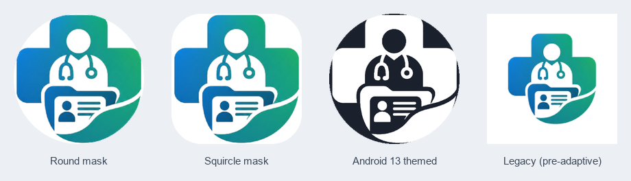

*Rendered from the shipped `drawable-xxxhdpi` layers and
`@color/ic_launcher_background`, masked the way Android does — round, squircle,
Android 13 themed, and the legacy square.*

## 4. In-app usage

`lib/shared/widgets/brand_logo.dart` is the only file that names an asset path.
It offers `BrandLogo.full` / `.mark` / `.markWhite` (variants `full`, `mark`,
`markWhite`) plus `BrandAppBarTitle`, which chooses the white or the coloured
mark from the app bar's own brightness so a screen never has to know which it
has. Everything is `BoxFit.contain`; nothing is stretched.

| Screen | Before | After |
|---|---|---|
| S01 splash | tinted disc + `Icons.health_and_safety_outlined` + "Mero Swasthya" in type | `logo_full` at 60 % of the screen width; the separate title is gone, because the lock-up already says the name |
| S02 phone entry | tinted disc + phone glyph | `logo_full` at 40 % width |
| S04 PIN unlock | tinted disc + padlock glyph | `logo_full` at 40 % width |
| S06 family list app bar | greeting only | `BrandAppBarTitle` — coloured mark at 24 px |
| S19 provider home app bar | facility name only | `BrandAppBarTitle` — white mark at 24 px on the dark bar |
| Printable card header | health-and-safety glyph + "Mero Swasthya" in type | `logo_full` at 72 px |
| PDF export header | "Mero Swasthya" in 20 pt bold | `logo_full` at 56 pt, falling back to the typeset name when no bytes are supplied |
| Settings footer | "About" only | `logo_mark` at 40 px above "About" |

The `_AuthGlyph` helper in `phone_screen.dart` was removed — nothing referenced
it once the lock-up took its place, and two badges on one short screen read as
clutter.

`PdfFonts` gained an optional `logo` field. The bytes are loaded by
`PatientPdfService.loadFonts()` and passed in, for the same reason the
Devanagari faces are: `rootBundle` is not reachable from the pure-Dart tests
that build a document.

**One regression found on the phone and fixed:** at 28 px with the gutter's
leading gap, the mark pushed the family list's greeting into an ellipsis —
"Namaste, Sita Chaudh…". `BrandAppBarTitle` now defaults to 24 px with an 8 px
gap, and S06 uses `titleSpacing: AppSpacing.md`. The full greeting fits again.

## 5. App name and native splash

`android:label` was already `Mero Swasthya`; unchanged.

The native splash is now the background token with the mark centred. Both
handsets are API 33+, so the path that actually shows is Android 12's
SplashScreen API (`values-v31`), which draws the launcher icon on
`@color/splash_background`. `launch_background.xml` was updated too, for
anything older.

## 6. Screens, from both phones

### Launcher icon

| Before (provider phone) | After (patient, round mask) | After (provider, round mask) |
|---|---|---|
| 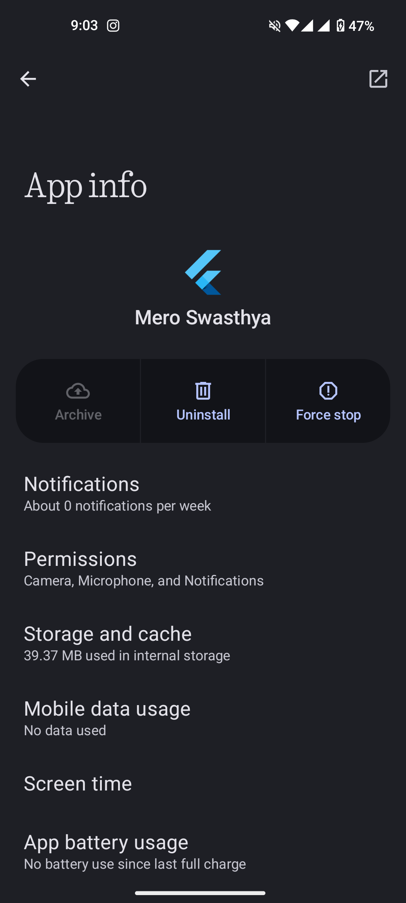 | 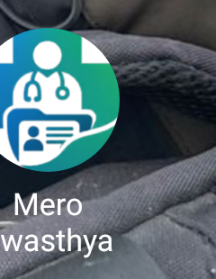 |  |

The before shot is the stock Flutter logo under the label "Mero Swasthya",
captured from the provider phone's App info before the new build went on.

Neither launcher cached the old icon — the new mark appeared immediately after
`install -r`, so no `pm clear` of the launcher and no reboot was needed on
either phone.

**Both handsets happen to mask icons as circles** (MIUI's drawer and Nothing
OS both do), so the squircle is not photographable on this hardware. The
squircle in the mask sheet above is rendered from the shipped drawables rather
than from a launcher, and is labelled as such.

### App info

| Patient | Provider |
|---|---|
| 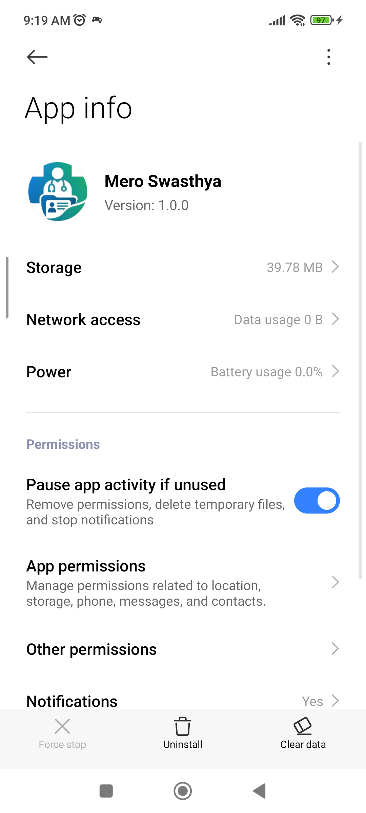 | 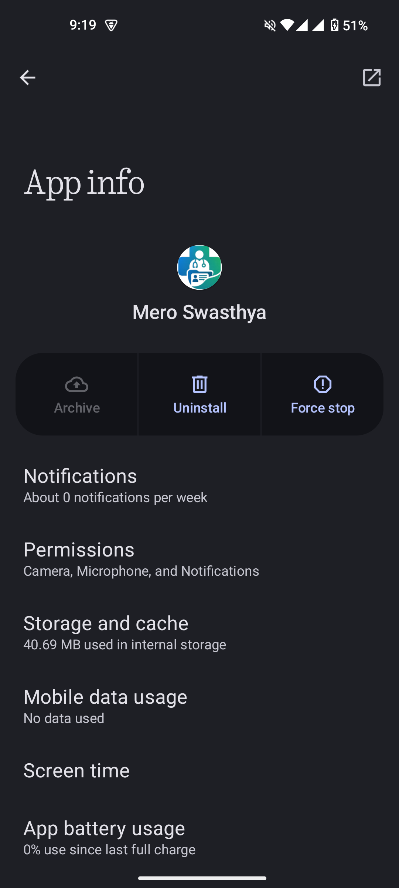 |

### Splash

| Patient — S01 (Flutter) | Patient — native | Provider — native (dark) |
|---|---|---|
| 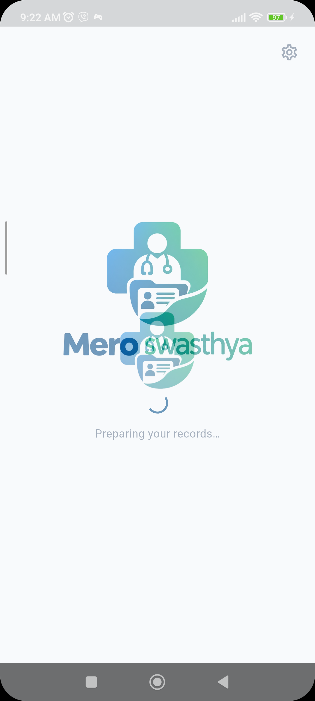 | 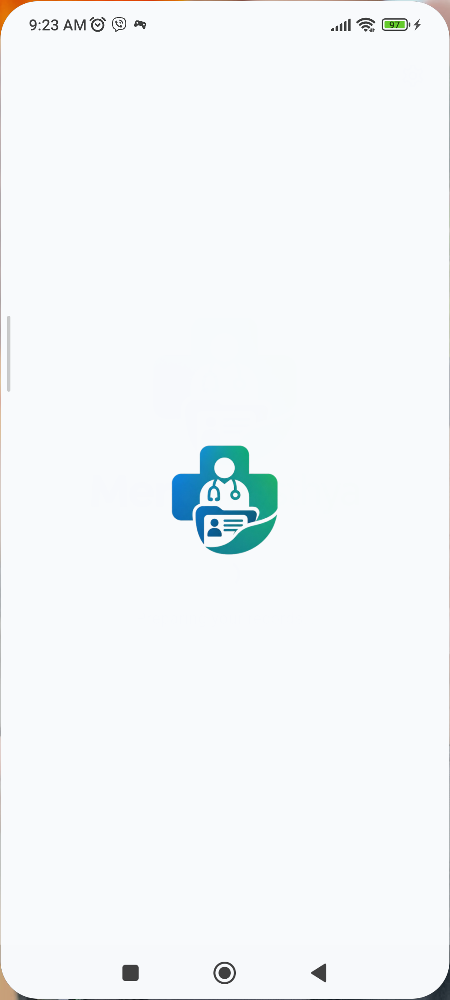 | 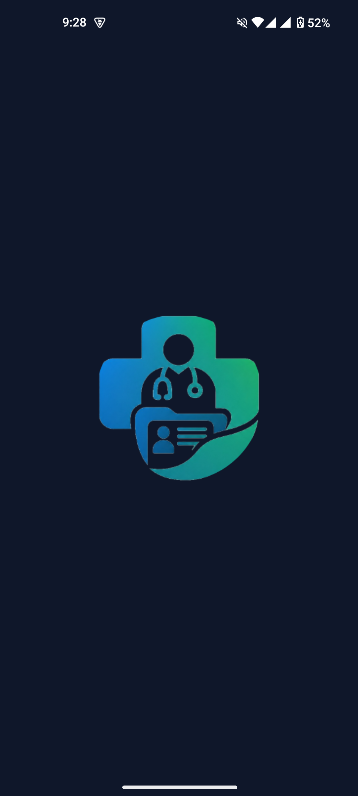 |

S01 could not be photographed on the Nothing phone: it goes from the native
splash straight to the unlock screen inside 0.5 s. Delays of 0.45, 0.50, 0.55
and 0.60 s all landed on S04. The same was true of the end-user verification
earlier, so this is the hardware being fast rather than the screen being
missing.

### Login

| Patient — S04 (light) | Provider — S04 (dark) |
|---|---|
| 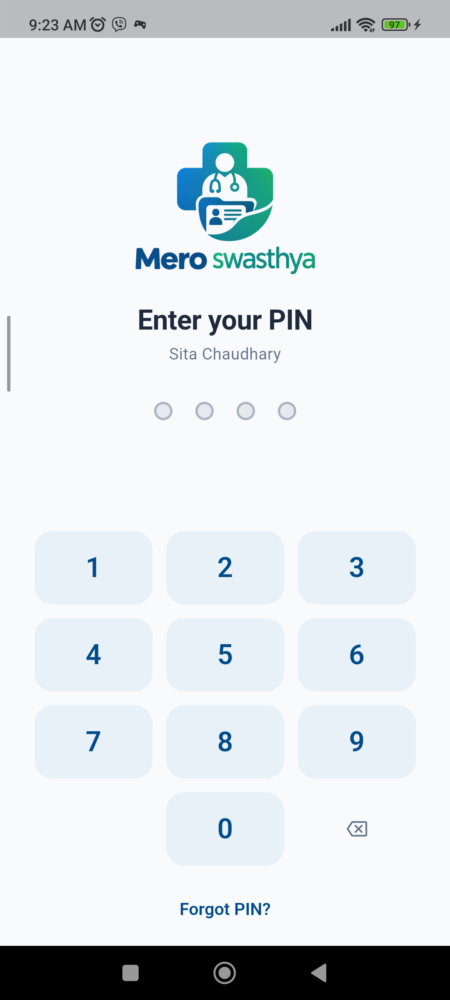 | 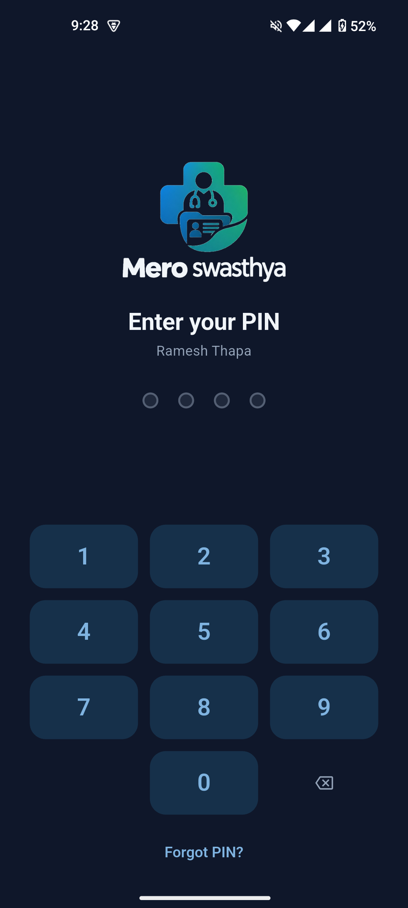 |

The provider shot is what `logo_full_dark` exists for: the white wordmark on
`#0F172A` with the mark keeping its own gradient.

### Home

| Patient — S06 family list | Provider — S19 provider home |
|---|---|
| 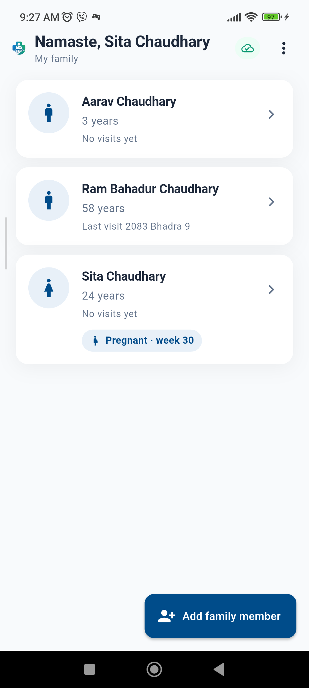 | 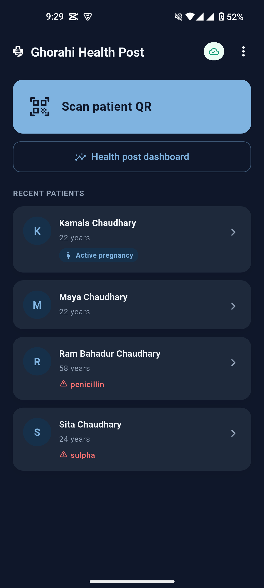 |

### Other placements

| Printable card | Settings footer |
|---|---|
| 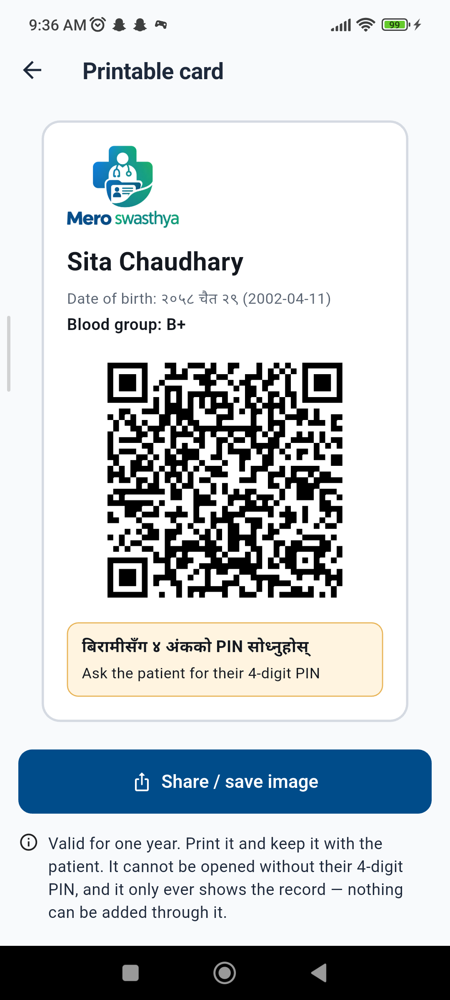 | 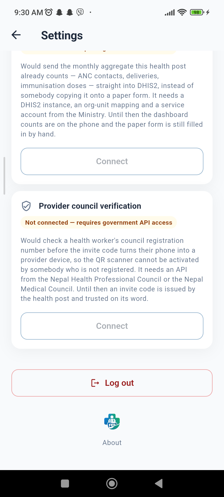 |

The card's lock-up was raised from 40 px to 72 px after the first pass: the
artwork is nearly square, so height drives width, and at 40 px the wordmark
came out about 11 px tall and unreadable once printed.

## 7. Size cost

The arm64 APK went from **32.3 MB** to **33.7 MB** — about **1.4 MB**, nearly
all of it `logo_full` plus `logo_full_dark`, which are kept at 963 px because
the PDF header prints them.

A first pass reached 34.6 MB by registering the whole `assets/brand/` directory
and cutting the in-app mark at 1024 square. Splitting the launcher sources into
`assets/brand/icon/` (not bundled) and cutting the runtime mark at 256 — still
six times the largest on-screen use, the 40 dp settings footer on a 3× screen —
gave 0.9 MB back.

## 8. Reproducing

```bash
python tools/brand/make_brand.py        # assets + res/drawable-*/splash_mark.png
dart run flutter_launcher_icons          # mipmaps, adaptive + monochrome layers
# then restore the inset-free mipmap-anydpi-v26/ic_launcher.xml (see §3)
flutter build apk --release --split-per-abi --dart-define=MOCK_API=true
adb -s <serial> install -r build/app/outputs/flutter-apk/app-arm64-v8a-release.apk
```
