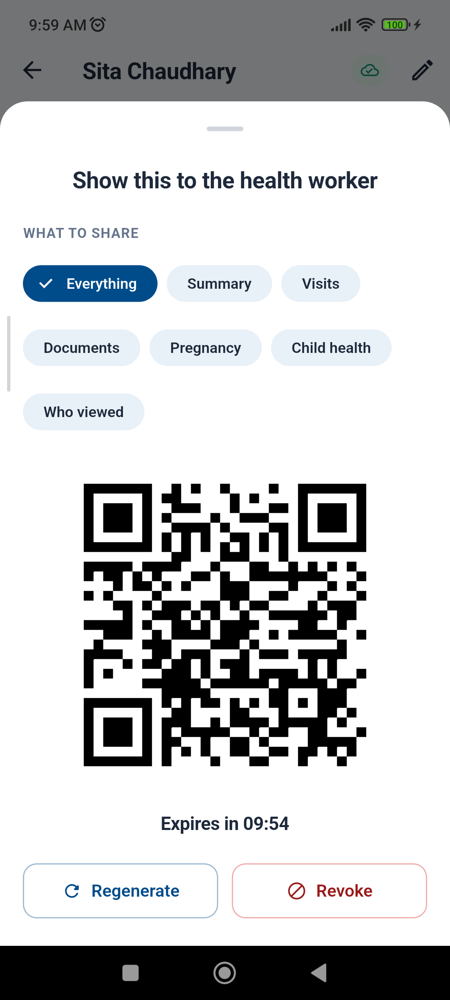
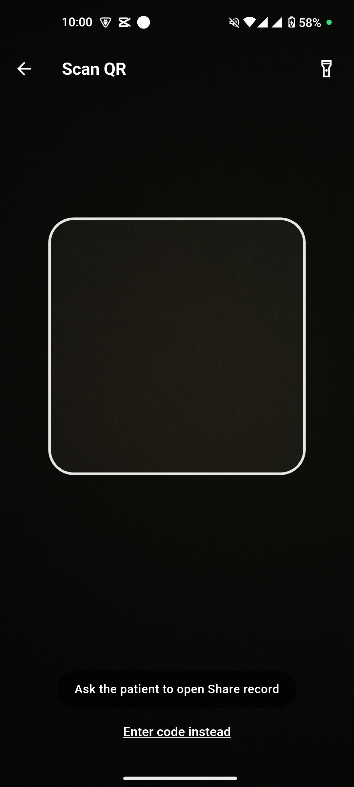
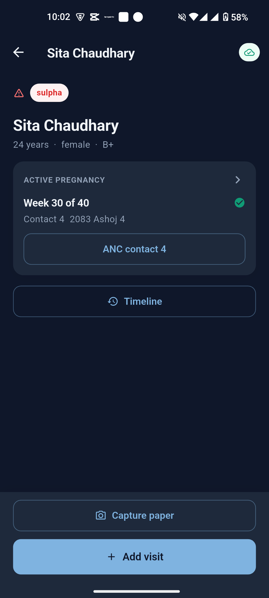
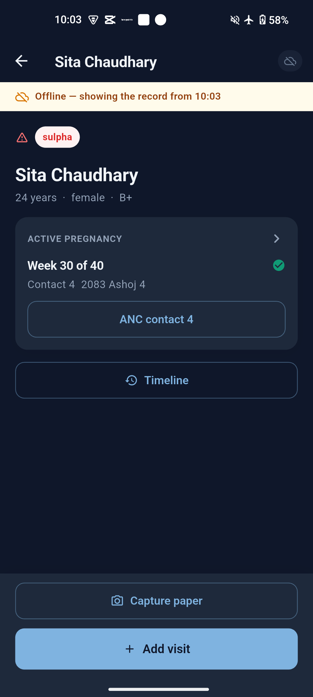
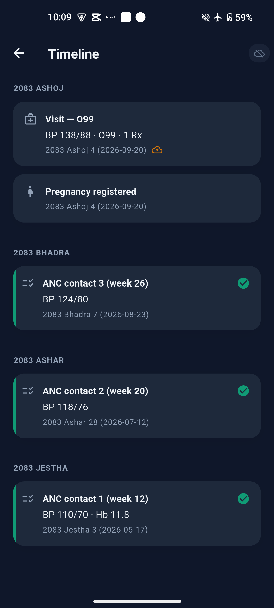
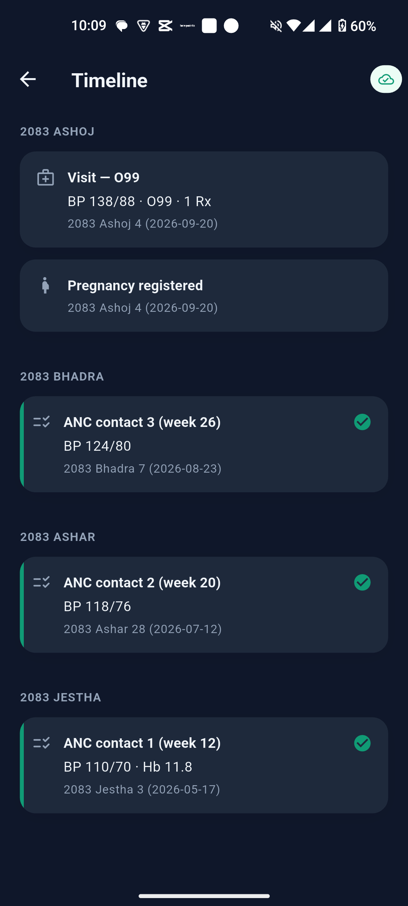
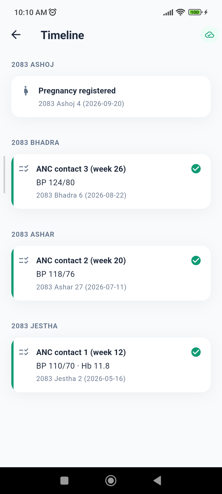
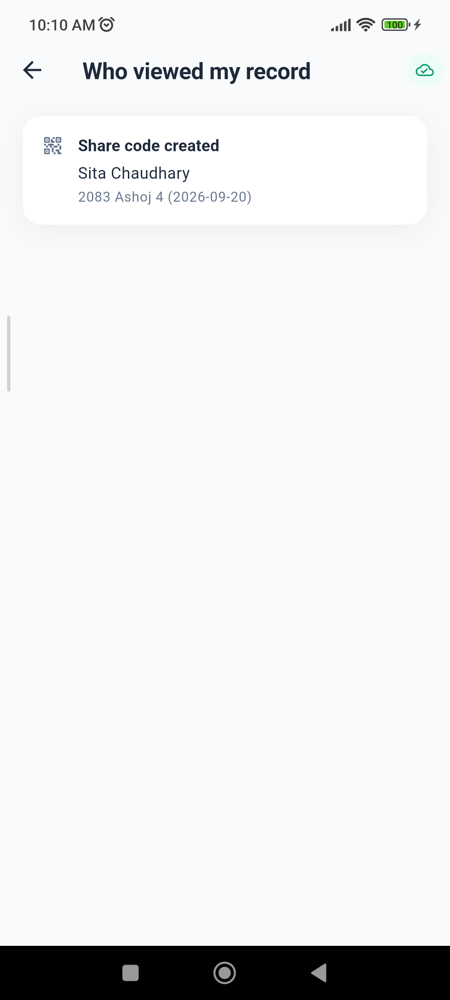

# Phone-to-phone QR scan, on mock data

**Date:** 20 September 2026
**Build:** `build/MeroSwasthya-qrdemo-arm64-v8a.apk`, 35,356,007 bytes (33.7 MB),
`--release --split-per-abi --dart-define=MOCK_API=true`
**Checks:** `flutter analyze` — no issues; `flutter test` — **636 passing**
**Installed:** `adb install -r` on both phones, data kept

---

## 1. Device mapping

| Role | Serial | Model | Android | Screen | How the role was confirmed |
|---|---|---|---|---|---|
| **PATIENT** | `483a08e5` | POCO M2102J20SI | 13 (SDK 33) | 1080×2400 @ 440 dpi | signed in to Sita Chaudhary's household; light theme |
| **PROVIDER** | `P21297002263` | Nothing A063 | 15 (SDK 35) | 1080×2400 @ 420 dpi | unlock screen reads **Ramesh Thapa**; activated with `HA-GHORAHI-01`, provider home shows Ghorahi Health Post; dark theme |

Both were kept awake (`svc power stayon true`, `screen_off_timeout 2147483647`,
`accelerometer_rotation 0`). The patient phone's brightness was pinned to
maximum for the scan and returned to automatic afterwards.

## 2. The mock change

`lib/core/net/mock_api.dart`, in `POST /grants/redeem`.

Each phone runs its **own** in-process `MockApi`, so each has its own `_grants`
map. A code drawn on the patient phone is a code the provider's instance has
never issued, and the redeem died on `Unknown QR code` — which is precisely the
moment the demo exists to show.

`_redeemGrant` now adopts a foreign code when, and only when, it is shaped like
one this mock would itself have minted:

```dart
static final RegExp _mockGrantToken = RegExp(
  r'^mock_grant_[0-9a-fA-F]{8}-[0-9a-fA-F]{4}-[0-9a-fA-F]{4}'
  r'-[0-9a-fA-F]{4}-[0-9a-fA-F]{12}$',
);

bool _looksLikeForeignGrant(String payload, String token) =>
    payload.startsWith(qrPrefix) && _mockGrantToken.hasMatch(token);
```

`_adoptForeignGrant` writes the code into `_grants` against the seeded Sita
(`MockApi.sitaId`) with a ten-minute window and a `grant_created` audit entry,
then **falls through to the existing redeem path** — one redeem, one bundle,
one audit trail. So the adopted code still gets `accessUntil = now + 24 h`, a
`grant_redeemed` audit row, and the full bundle: patient, summary, timeline,
pregnancy and all eight ANC contacts.

Both helpers and the call site carry the comment
**`DEMO: mock only — the real backend validates the JWT.`**

The expiry window is measured from adoption rather than from whenever the other
phone drew the code: the two clocks are not the same clock, and a code that
arrived already expired would be worse than no leniency at all.

**Nothing else is relaxed.** A code this instance *did* issue still goes through
the expiry, revoke and already-redeemed checks. Rejected as before:

| Payload | Why it is still a 404 |
|---|---|
| `HELLO` | not a grant token |
| `SWC1:HELLO` | right prefix, wrong token shape |
| `SWC1:mock_grant_not-a-uuid` | right prefix, not a UUID |
| `mock_grant_<uuid>` (no prefix) | not a Swasthya code |
| `SWC1:mock_grant_<truncated uuid>` | not a UUID |

### Tests added — `test/net/mock_api_test.dart`

1. **`a code this instance never issued is adopted for the demo`** — redeems a
   hard-coded foreign token, asserts the bundle is Sita (allergy `sulpha`),
   `accessUntil` is exactly 24 h out, the pregnancy is present with 8 contacts,
   the timeline is non-empty, and the audit contains `AuditAction.grantRedeemed`.
2. **`an adopted code is still one-shot and still expires`** — after adoption,
   advancing the clock 11 minutes makes the same code throw `GRANT_EXPIRED`.
3. **`leniency does not extend to payloads that are not grant codes`** — the
   five payloads in the table above each still throw `NOT_FOUND`.

## 3. The live camera scan

**Succeeded on the first attempt.** No retry, no fallback to "Enter code
instead".

Setup: patient phone showing Sita → Share record (QR) with the countdown
running at 09:54 remaining, screen at maximum brightness; provider phone on
**Scan QR** with a live preview. The two were hand-held at the **15–25 cm the
operator was asked to use**, provider camera square-on — the exact distance was
not measured, so treat that range as the instruction rather than a measurement.

The payload on the patient's screen, decoded from the screenshot for the
record, was `SWC1:mock_grant_36bfef71-7d79-45ee-8015-db80482e47a7`. The
provider's instance had never issued it, so this is the adoption path doing its
job end to end.

| Patient — QR on screen | Provider — live preview | Provider — S21 after the scan |
|---|---|---|
|  |  |  |

S21 on the provider phone shows:

- **pinned allergy row `sulpha`** — red warning triangle and red pill, held at
  the top of the scroll view;
- **ACTIVE PREGNANCY — Week 30 of 40**, next contact 4 on 2083 Ashoj 4, with
  the ANC contact action;
- Timeline, and the full action bar (Capture paper / Add visit), i.e. write
  access rather than the read-only printed-card path.

**Last vitals were not shown at this point, and that is correct.** The seeded
Sita has no *visits* — her clinical history is the pregnancy and three ANC
contacts — and `lastVitals` is derived from visits. The card appeared as soon
as a visit existed; see the next section.

No Flutter exceptions on either phone. The one `E flutter` line in the
provider's logcat during this window belongs to `com.fonepoints.app` (PID 4214,
a different Flutter app on the handset); Mero Swasthya was PID 2949 and logged
nothing.

## 4. Offline visit on the provider phone

Airplane mode on → the amber banner **"Offline — showing the record from
10:03"** appeared and the sync chip went grey, even though `adb` stays up over
USB: the app keys off `connectivity_plus`, not off whether a socket happens to
work.

Visit recorded for Sita: complaint **Antenatal check**, **BP 138/88**,
diagnosis **Anaemia in pregnancy (O99)**, **Calcium 500 mg — 1 tab · BD · 5d**
with the Nepali instruction chip **सुत्ने बेला**, follow-up **2083 Ashoj 11
(2026-09-27)**.

| Offline banner | Saved, pending | Synced |
|---|---|---|
|  |  |  |

On save, S21 updated immediately: **CURRENT MEDICINES** gained the calcium with
its Nepali instruction, and **LAST VITALS** appeared showing **BP 138/88 mmHg,
2083 Ashoj 4**. The timeline row carried the amber pending-cloud marker. With
airplane mode off the queue drained, the marker cleared and the sync chip
returned to green.

### What does *not* happen, by design

The visit **does not reach the patient phone**, and in mock mode it cannot.

| Patient — Sita's timeline after the provider's visit | Patient — Who viewed my record |
|---|---|
|  |  |

The patient's timeline still shows only the pregnancy registration and the
three seeded ANC contacts — no `Visit — O99`. Her audit reads **"Share code
created"** and nothing else: the matching `grant_redeemed` row was written into
the *provider's* mock, because that is the instance that redeemed it.

This is the boundary of mock mode, not a defect. `--dart-define=MOCK_API=true`
puts the server inside the app, so "sync" means "reconcile with my own
in-process mock". **The cross-phone sync moment needs the real backend**: two
phones talking to one server over `adb reverse tcp:3000`, where the provider's
push and the patient's pull meet in the same database. Everything up to that
point — the QR, the camera, the redeem, the bundle, the offline queue, the
pending marker, the drain — is real and was demonstrated above.

## 5. For the demo

- Draw the QR fresh on the patient phone immediately before scanning; the
  window is ten minutes and the countdown is on screen.
- Put the patient phone's brightness up. It is the single thing that most
  affects whether the camera locks on.
- Hold roughly 15–25 cm apart, square-on, and give it a moment to focus. It
  read first time at that distance on these two handsets.
- If the camera does not lock, **Enter code instead** on the scanner accepts
  the same `SWC1:…` string typed by hand — the leniency above applies to it
  equally.
- Do not restart either app between recording something and showing it: the
  mock holds its state in memory and a relaunch re-seeds it.
- Say out loud that the provider's visit stays on the provider's phone in this
  mode, or do the visit *before* the scan so the record you show is the one the
  audience just watched arrive.
